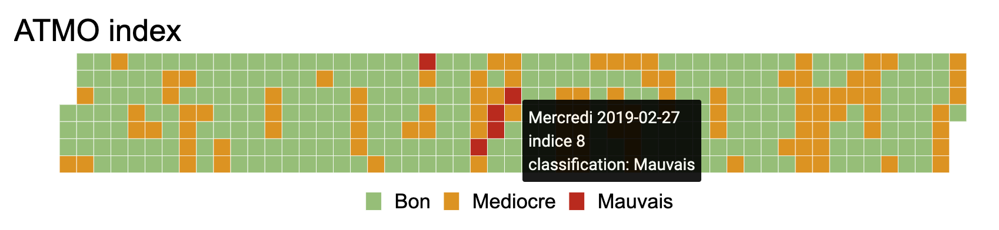

<!-- README.md is generated from README.Rmd. Please edit that file -->

# airparis

<!-- badges: start -->

<!-- badges: end -->

Package `airparis` is providing a small set of functions to access data
about air quality in Ile-de-France provided by
[Airparif](https://www.airparif.asso.fr/).



Users can retrieve hourly and daily data measured in Ile-de-France with
function `read_measures()`. The following pollutants are available:

  - `o3`: ozone
  - `pm10`: Particulate matter with a diameter of 10 micrometers or less
  - `pm25`: Particulate matter with a diameter of 2.5 micrometers or
    less
  - `nox`: Nitrogen oxide
  - `no2`: Nitrogen dioxide

<!-- end list -->

``` r
library(airparis)
read_measures(pollutant = "pm10", station_id = "4181",
  dt_start = as.Date("2019-06-01"), dt_end = as.Date("2019-06-04"), 
  granularity = "day")
#>   code_station_ue value  date_time pollutant
#> 1            4181   8.8 2019-06-01      pm10
#> 2            4181  10.0 2019-06-02      pm10
#> 3            4181  10.8 2019-06-03      pm10
#> 4            4181  13.7 2019-06-04      pm10
```

The stations where measures are made are available in dataset
`stations`:

``` r
utils::head( stations )
#>   station_ue_code              township_name township_id    station_name
#> 1            4002              GENNEVILLIERS       92036   GENNEVILLIERS
#> 2            4024                    GONESSE       95277         GONESSE
#> 3            4029                 VERSAILLES       78646      VERSAILLES
#> 4            4034            VITRY-SUR-SEINE       94081 VITRY-SUR-SEINE
#> 5            4038 CLAIREFONTAINE-EN-YVELINES       78164  Zone Rurale SO
#> 6            4049   SAINT-JEAN-DE-BEAUREGARD       91560        LES ULIS
#>   station_x station_y    o3  pm10  pm25   nox   no2
#> 1    648292   6870262 FALSE  TRUE  TRUE  TRUE  TRUE
#> 2    659365   6876912 FALSE FALSE  TRUE  TRUE  TRUE
#> 3    636191   6855823  TRUE FALSE FALSE  TRUE  TRUE
#> 4    654122   6853046  TRUE  TRUE  TRUE  TRUE  TRUE
#> 5    617586   6831928  TRUE FALSE FALSE FALSE FALSE
#> 6    638491   6842410  TRUE FALSE FALSE FALSE FALSE
```

Function `read_atmo()` read ATMO index and return them in a data.frame.
The data is only containing the last year of daily historic. The air
quality index ranges from 1 (very good) to 10 (very bad). It
characterizes in a simple and comprehensive way the air quality of an
urban agglomeration. It is not possible to reproduce exact calculations
as so2 is not available through the web service or with
read\_measures().

``` r
utils::tail( read_atmo() )
#>      date_time score
#> 360 2019-08-24     5
#> 361 2019-08-25     7
#> 362 2019-08-26     6
#> 363 2019-08-27     7
#> 364 2019-08-28     5
#> 365 2019-08-29     4
```

Function `read_alert()` read air quality alerts issued by airparif.

``` r
utils::tail( read_alert() )
#>     date_time pollutant                                     state
#> 23 2019-06-29        o3 Niveau d'information et de recommandation
#> 24 2019-07-06        o3 Niveau d'information et de recommandation
#> 25 2019-07-22        o3 Niveau d'information et de recommandation
#> 26 2019-07-24        o3                           Niveau d'alerte
#> 27 2019-07-25        o3 Niveau d'information et de recommandation
#> 28 2019-08-27        o3 Niveau d'information et de recommandation
```

Pollutants emissions are available for 2015 as data.frame (see
`emissions_epci`, `emissions_region`, `emissions_departement`):

``` r
utils::head( emissions_epci )
#>    gid                         lib_epci year   pm10   pm25     nox    so2
#> 1   22 CA Coeur d'Essonne Agglomération 2015 272100 211300 1245900  31100
#> 2   24       CA Communauté Paris-Saclay 2015 487800 375400 3627500 167800
#> 3 1004      CA Coulommiers Pays de Brie 2015 319100 175900  507300  17400
#> 4  128             CA de Cergy-Pontoise 2015 210500 155400 1228100 320800
#> 5  140  CA de Saint Quentin en Yvelines 2015 287700 203800 1443200  23800
#> 6  189      CA du Pays de Fontainebleau 2015 252100 156800 1088100  16000
#>     co    nh3   covnm     co2
#> 1 3300  36100 1116800  529800
#> 2 5600  68400 2379500 1196100
#> 3 2300 275400 1443500  160800
#> 4 2700  20700 1106600  578800
#> 5 3100  38200 1373000  570800
#> 6 2000  92700 1646800  340200
```

## Installation

You can install the development version of airparis from
[github](https://github.com/ardata-fr/airparis) with:

``` r
remotes::install_github("ardata-fr/airparis")
```
